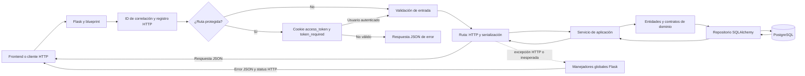

# Backend de Mis Eventos

API HTTP para gestionar cuentas, eventos, sesiones e inscripciones. Está implementada con Python 3.12+, Flask, SQLAlchemy, PostgreSQL y Alembic. La especificación OpenAPI se sirve con Flasgger.

## Arquitectura

El backend separa HTTP, casos de uso, dominio e infraestructura sin añadir una capa de controladores independiente: las rutas Flask actúan como controladores.



- `app/api/`: blueprints, validación en el límite HTTP, autenticación, serialización, respuestas y manejadores globales de errores.
- `app/application/`: coordinación de autenticación, eventos, registros, sesiones y salud; incluye DTOs y casos de uso.
- `app/domain/`: entidades, excepciones, contratos de repositorio y reglas del dominio.
- `app/infrastructure/`: modelos SQLAlchemy, repositorios y comprobación de salud.
- `app/docs/`: OpenAPI y configuración de Swagger UI.
- `app/observability/`: logs JSON y métricas Prometheus locales.
- `migrations/`: revisiones Alembic; `tests/`: pruebas unitarias y de integración.
- `dependencies.py` construye los servicios con repositorios asociados a la sesión SQLAlchemy actual; `main.py` configura Flask, extensiones, blueprints y componentes transversales.

Las rutas públicas no leen una identidad. En las protegidas, `token_required` valida la cookie HttpOnly y adjunta el usuario autenticado; los servicios aplican además las reglas de propiedad y negocio. Errores de validación y de dominio se convierten en respuestas de API en las rutas; excepciones HTTP de Flask y fallos inesperados pasan por los manejadores globales. El cliente recibe JSON sin trazas internas.

## Requisitos y configuración local

Se necesitan Python 3.12 o superior, Poetry, Docker Compose si se usará PostgreSQL local mediante contenedor y, para las pruebas generales del repositorio, Node.js 22+, npm y GNU Make.

Desde la raíz, prepara los archivos de entorno sin reemplazar configuraciones existentes:

```sh
make setup
```

Este comando crea `.env` desde `.env.example` cuando no existe y prepara las dependencias de ambos proyectos. `JWT_SECRET_KEY` viene vacío en el ejemplo: genera un valor local y cópialo en `.env`:

```sh
python3 -c 'import secrets; print(secrets.token_urlsafe(48))'
```

No compartas ni subas `.env`. Las credenciales de PostgreSQL incluidas en Compose son solo para desarrollo local. Variables del backend:

| Variable | Uso |
| --- | --- |
| `DATABASE_URL` | URL de PostgreSQL. Por defecto usa `localhost:5432`; Compose inyecta el host `db`. |
| `JWT_SECRET_KEY` | Clave privada de firma JWT, mínimo 32 bytes. Obligatoria para autenticación y para que readiness responda disponible. |
| `JWT_ACCESS_TOKEN_TTL_SECONDS` | Duración del token en segundos; predeterminado `3600`. Debe ser positivo. |
| `JWT_COOKIE_SECURE` | Atributo Secure de la cookie. Predeterminado `false` en local; producción requiere `true`. |
| `APP_ENVIRONMENT` | Etiqueta de entorno; predeterminada `local`. El nombre se normaliza a minúsculas. |
| `APP_VERSION`, `SERVICE_NAME`, `LOG_LEVEL` | Etiquetas de logs y servicio. Predeterminados `dev`, `mis-eventos-backend` e `INFO`. |

Para iniciar PostgreSQL local con Compose, desde la raíz:

```sh
docker compose up -d db
```

Las migraciones y Alembic deben recibir `DATABASE_URL`. Para ejecutar el backend directamente, abre una terminal en `backend`, carga las variables de la raíz y usa Poetry:

```sh
cd backend
poetry install --with dev --no-root
set -a
. ../.env
set +a
poetry run alembic upgrade head
poetry run python -m app
```

El servidor escucha en el puerto `5000`; en el equipo local se accede como <http://localhost:5000>. `python -m app` no carga `.env` automáticamente, por eso el ejemplo exporta sus valores en la shell. Alembic lee la misma fuente `DATABASE_URL` que la aplicación.

### Ejecutar todo con Docker Compose

Desde la raíz, crea `.env`, establece una clave JWT local de al menos 32 bytes y ejecuta:

```sh
make check
make setup
make run
make status
```

`make run` construye e inicia `db`, `backend` y `frontend`, espera PostgreSQL, aplica las migraciones y comprueba las URLs de disponibilidad. `make stop` detiene y elimina los contenedores y la red, pero conserva el volumen PostgreSQL. No uses comandos de limpieza de volúmenes si quieres conservar los datos.

| Servicio | URL local |
| --- | --- |
| Aplicación frontend | <http://localhost:5173> |
| Backend | <http://localhost:5000> |
| Swagger UI | <http://localhost:5000/apidocs/> |
| Especificación OpenAPI JSON | <http://localhost:5000/apispec_1.json> |
| Salud básica | <http://localhost:5000/api/v1/health> |
| Liveness | <http://localhost:5000/api/v1/live> |
| Readiness | <http://localhost:5000/api/v1/ready> |
| Métricas | <http://localhost:5000/metrics> |

Swagger requiere que el backend esté iniciado. El archivo fuente es `app/docs/openapi.yaml`. `health` solo confirma que la ruta responde; `live` confirma que Flask está disponible; `ready` comprueba la clave JWT y ejecuta `SELECT 1` en PostgreSQL, con 503 si falla una dependencia.

## API HTTP

El prefijo de todas las rutas de recursos es `/api/v1`. Las rutas protegidas requieren la cookie `access_token`, que establece el endpoint de login. Los errores JSON usan `{ "error": { "code": "…", "message": "…" } }`; conflictos de concurrencia también pueden incluir `current_version`. Las respuestas 204 no tienen cuerpo.

### Autenticación

| Método y ruta | Acceso | Resultado principal |
| --- | --- | --- |
| `POST /auth/register` | Público | Crea cuenta, 201; 400 si los datos no validan, 409 si el correo ya existe. |
| `POST /auth/login` | Público | Comprueba credenciales y establece cookie HttpOnly; 200, 401 o 503 si falta configuración JWT. |
| `GET /auth/me` | Cookie | Devuelve el perfil público actual; 401 ante cookie ausente o inválida. |
| `POST /auth/logout` | Público | Expira la cookie y devuelve 204. |

### Eventos

| Método y ruta | Acceso | Uso y respuestas relevantes |
| --- | --- | --- |
| `GET /events` | Público | Catálogo paginado; acepta `page`, `page_size` y `q`; devuelve `events` y `pagination`. |
| `GET /events/{event_id}` | Público | Detalle del evento; 404 si no existe. |
| `GET /events/{event_id}/capacity` | Público | Capacidad, ocupación y cupos disponibles; 404 si no existe. |
| `GET /events/mine` | Cookie | Eventos propios; acepta `page`, `page_size`, `q` y `status`. La propiedad se obtiene de la sesión, no de un ID enviado. |
| `GET /events/mine/summary` | Cookie | Resumen de eventos propios. |
| `GET /events/mine/{event_id}` | Cookie y propietario | Detalle para administración; evento no propio o inexistente se informa como 404. |
| `POST /events` | Cookie | Crea un evento y devuelve 201 con `event`; requiere datos válidos. |
| `PATCH /events/{event_id}` | Cookie y propietario | Actualiza campos del evento; requiere `version`; 403 sin permiso, 404 inexistente, 409 conflicto de versión. |
| `DELETE /events/{event_id}` | Cookie y propietario | Elimina y responde 204; 403 sin permiso, 404 inexistente, 409 si hay registros relacionados. |

### Inscripciones a eventos

| Método y ruta | Acceso | Uso y respuestas relevantes |
| --- | --- | --- |
| `GET /registrations/me` | Cookie | Lista inscripciones propias con `page`, `page_size`, `status` y `period`. |
| `GET /registrations/me/summary` | Cookie | Resumen de las inscripciones propias. |
| `POST /events/{event_id}/registrations/me` | Cookie | Crea o reactiva inscripción; 201. Devuelve 404 si el evento no existe y 409 si no admite registros, no hay cupos o ya existe uno activo. |
| `DELETE /events/{event_id}/registrations/me` | Cookie | Cancela la inscripción propia y las inscripciones activas a sus sesiones; devuelve 204. |

### Sesiones y asistentes

| Método y ruta | Acceso | Uso y respuestas relevantes |
| --- | --- | --- |
| `GET /events/{event_id}/sessions` | Público | Lista sesiones del evento. |
| `GET /events/{event_id}/sessions/{session_id}` | Público | Devuelve una sesión perteneciente al evento. |
| `POST /events/{event_id}/sessions` | Cookie y propietario del evento | Crea sesión; 201; 403 si no es propietario. |
| `PATCH /events/{event_id}/sessions/{session_id}` | Cookie y propietario del evento | Actualiza sesión; requiere `version`; 403 sin permiso y 409 ante conflicto. |
| `DELETE /events/{event_id}/sessions/{session_id}` | Cookie y propietario del evento | Elimina sesión y devuelve 204; 403 sin permiso. |
| `GET /events/{event_id}/sessions/{session_id}/capacity` | Público | Devuelve capacidad, ocupación y cupos disponibles. |
| `GET /events/{event_id}/sessions/{session_id}/attendees` | Cookie y propietario del evento | Lista asistentes; 403 si no es propietario. |
| `POST /events/{event_id}/sessions/{session_id}/attendees` | Cookie | Inscribe al usuario actual; 201 o 409 por duplicidad/capacidad. |
| `DELETE /events/{event_id}/sessions/{session_id}/attendees/me` | Cookie | Cancela solo la inscripción propia; devuelve 204. |

La creación de sesión requiere `title`, `starts_at`, `ends_at` y `capacity`; `description` y `speaker_ids` son opcionales. En actualizaciones de eventos y sesiones se requiere `version` para control de concurrencia. Las fechas de una sesión deben estar dentro del intervalo del evento.

### Ejemplos con curl

Con el backend local iniciado, consulta salud y catálogo:

```sh
curl -i http://localhost:5000/api/v1/health
curl -i 'http://localhost:5000/api/v1/events?page=1&page_size=20'
```

Registra una cuenta de prueba (usa un correo que no esté ya registrado) y luego inicia sesión. El cookie jar conserva la cookie HTTP entre las llamadas:

```sh
curl -i -X POST http://localhost:5000/api/v1/auth/register \
  -H 'Content-Type: application/json' \
  -d '{"email":"alex@example.test","password":"Example-only-123","first_name":"Alex","last_name":"Rivera"}'

curl -i -c /tmp/mis-eventos-cookies.txt -X POST http://localhost:5000/api/v1/auth/login \
  -H 'Content-Type: application/json' \
  -d '{"email":"alex@example.test","password":"Example-only-123"}'
curl -i -b /tmp/mis-eventos-cookies.txt http://localhost:5000/api/v1/auth/me
```

Con esa sesión puedes crear un evento. Ajusta las fechas a un intervalo futuro y válido; sustituye `{event_id}` por el ID devuelto para consultarlo o inscribirte:

```sh
curl -i -b /tmp/mis-eventos-cookies.txt -X POST http://localhost:5000/api/v1/events \
  -H 'Content-Type: application/json' \
  -d '{"title":"Evento de prueba","description":"Datos de ejemplo","location":"Medellín","starts_at":"2030-05-01T14:00:00Z","ends_at":"2030-05-01T16:00:00Z","capacity":20,"status":"published"}'

curl -i -b /tmp/mis-eventos-cookies.txt -X POST \
  http://localhost:5000/api/v1/events/{event_id}/registrations/me
```

La inscripción requiere un evento publicado, futuro y con capacidad. Si eres el creador, también puedes añadir una sesión dentro del intervalo del evento:

```sh
curl -i -b /tmp/mis-eventos-cookies.txt -X POST \
  http://localhost:5000/api/v1/events/{event_id}/sessions \
  -H 'Content-Type: application/json' \
  -d '{"title":"Taller de ejemplo","starts_at":"2030-05-01T14:00:00Z","ends_at":"2030-05-01T15:00:00Z","capacity":20}'
```

Para cerrar la sesión:

```sh
curl -i -b /tmp/mis-eventos-cookies.txt -X POST http://localhost:5000/api/v1/auth/logout
```

## Logs, métricas y pruebas

Los logs JSON de ciclo de vida y solicitudes se escriben en stdout e incluyen el `X-Request-ID` de correlación. El servidor devuelve ese ID en la respuesta; los IDs entrantes se aceptan solo si tienen formato y longitud acotados. En Compose, consulta logs con `make logs` o `docker compose logs --tail=100 backend`.

`GET /metrics` expone las métricas Prometheus del proceso: solicitudes y latencia HTTP (por plantilla de ruta, método y status), solicitudes en curso, eventos creados e inscripciones completadas. Métricas, liveness, readiness y health no se incluyen en los contadores HTTP. La ruta publicada de métricas está enlazada a loopback por Compose.

Desde `backend/`:

```sh
poetry run pytest
poetry run ruff check .
poetry run ruff format --check .
set -a
. ../.env
set +a
poetry run alembic current
```

Desde la raíz, `make test-backend` ejecuta pytest con cobertura de líneas y ramas; `make lint` ejecuta Ruff y ESLint. `make migrate` aplica migraciones en el stack Compose activo. Si readiness responde 503, revisa que PostgreSQL esté disponible, que Alembic haya aplicado el esquema y que `JWT_SECRET_KEY` tenga al menos 32 bytes. `make status` y `make logs` ayudan a diagnosticar el stack sin mostrar valores secretos.

## Probar la aplicación completa

1. Desde la raíz, prepara `.env` con `make setup` y establece un `JWT_SECRET_KEY` local.
2. Ejecuta `make run`: inicia PostgreSQL, backend y frontend, aplica migraciones y espera los health checks.
3. Comprueba `http://localhost:5000/api/v1/ready` y abre Swagger en <http://localhost:5000/apidocs/>.
4. Abre <http://localhost:5173>, crea una cuenta o inicia sesión y crea un evento con fecha futura.
5. Abre el evento, crea una sesión e inscríbete desde otra cuenta para probar el flujo de asistente. Las acciones de administración se limitan al creador.
6. Ante un fallo, consulta `make status`, `make logs` y la consola de red del navegador. Detén el entorno con `make stop`; el volumen de base de datos se conserva.
