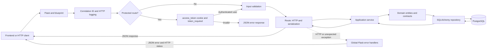

# Mis Eventos Backend

HTTP API for managing accounts, events, sessions, and registrations. It uses Python 3.12+, Flask, SQLAlchemy, PostgreSQL, and Alembic. Flasgger serves the OpenAPI specification.

## Architecture

The backend separates HTTP handling, use cases, domain logic, and infrastructure. Flask routes serve as controllers; there is no separate controller layer.



- `app/api/`: blueprints, HTTP boundary validation, authentication, serialization, responses, and global error handlers.
- `app/application/`: authentication, event, registration, session, and health orchestration, including DTOs and use cases.
- `app/domain/`: entities, exceptions, repository contracts, and domain rules.
- `app/infrastructure/`: SQLAlchemy models, repositories, and health checks.
- `app/docs/`: OpenAPI and Swagger UI configuration.
- `app/observability/`: structured JSON logs and local Prometheus metrics.
- `migrations/`: Alembic revisions; `tests/`: unit and integration tests.
- `dependencies.py` wires services to repositories using the current SQLAlchemy session; `main.py` configures Flask, extensions, blueprints, and cross-cutting components.

Public routes do not resolve a user identity. On protected routes, `token_required` validates the HttpOnly cookie and attaches the authenticated user; services also enforce ownership and business rules. Routes convert validation and domain errors into API responses, while Flask HTTP exceptions and unexpected failures pass through the global handlers. Clients receive JSON without internal tracebacks.

## Requirements and local setup

You need Python 3.12 or later and Poetry. Use Docker Compose if PostgreSQL will run in a local container. Repository-wide checks also require Node.js 22+, npm, and GNU Make.

From the repository root, create missing environment files without replacing existing configuration:

```sh
make setup
```

This command creates `.env` from `.env.example` if it does not exist and prepares dependencies for both applications. The example leaves `JWT_SECRET_KEY` empty. Generate a local value and add it to `.env`:

```sh
python3 -c 'import secrets; print(secrets.token_urlsafe(48))'
```

Do not share or commit `.env`. PostgreSQL credentials in Compose are for local development only. Backend variables:

| Variable | Purpose |
| --- | --- |
| `DATABASE_URL` | PostgreSQL connection URL. Defaults to `localhost:5432`; Compose injects the `db` hostname. |
| `JWT_SECRET_KEY` | Private JWT signing key, at least 32 bytes. Required for authentication and a ready response. |
| `JWT_ACCESS_TOKEN_TTL_SECONDS` | Token lifetime in seconds; defaults to `3600` and must be positive. |
| `JWT_COOKIE_SECURE` | Cookie Secure attribute. Defaults to `false` locally; production requires `true`. |
| `APP_ENVIRONMENT` | Environment label; defaults to `local` and is normalized to lowercase. |
| `APP_VERSION`, `SERVICE_NAME`, `LOG_LEVEL` | Service and log labels. Defaults are `dev`, `mis-eventos-backend`, and `INFO`. |

To start local PostgreSQL with Compose, run this command from the repository root:

```sh
docker compose up -d db
```

Alembic migrations require `DATABASE_URL`. To run the backend directly, open a terminal in `backend`, load the root environment variables, and use Poetry:

```sh
cd backend
poetry install --with dev --no-root
set -a
. ../.env
set +a
poetry run alembic upgrade head
poetry run python -m app
```

The server listens on port `5000` and is available locally at <http://localhost:5000>. `python -m app` does not load `.env` automatically, so the example exports its values in the shell. Alembic reads the same `DATABASE_URL` source as the application.

### Run the full stack with Docker Compose

From the repository root, create `.env`, set a local JWT key of at least 32 bytes, then run:

```sh
make check
make setup
make run
make status
```

`make run` builds and starts `db`, `backend`, and `frontend`, waits for PostgreSQL, applies migrations, and checks the availability URLs. `make stop` stops and removes the containers and network while preserving the PostgreSQL volume. Do not run volume cleanup commands if you need to keep the data.

| Service | Local URL |
| --- | --- |
| Frontend application | <http://localhost:5173> |
| Backend | <http://localhost:5000> |
| Swagger UI | <http://localhost:5000/apidocs/> |
| OpenAPI JSON specification | <http://localhost:5000/apispec_1.json> |
| Basic health | <http://localhost:5000/api/v1/health> |
| Liveness | <http://localhost:5000/api/v1/live> |
| Readiness | <http://localhost:5000/api/v1/ready> |
| Metrics | <http://localhost:5000/metrics> |

Swagger requires the backend to be running. Its source file is `app/docs/openapi.yaml`. `health` confirms the route responds; `live` confirms Flask is serving requests; `ready` validates the JWT key and runs `SELECT 1` against PostgreSQL, returning 503 if a dependency fails.

## HTTP API

All resource routes use the `/api/v1` prefix. Protected routes require the `access_token` cookie set by the login endpoint. JSON errors use `{ "error": { "code": "…", "message": "…" } }`; concurrency conflicts may also include `current_version`. Responses with status 204 have no body.

### Authentication

| Method and route | Access | Main result |
| --- | --- | --- |
| `POST /auth/register` | Public | Creates an account (201); 400 for invalid input, 409 if the email already exists. |
| `POST /auth/login` | Public | Checks credentials and sets an HttpOnly cookie (200); 401 for invalid credentials or 503 if JWT configuration is unavailable. |
| `GET /auth/me` | Cookie | Returns the current public profile; 401 if the cookie is missing or invalid. |
| `POST /auth/logout` | Public | Expires the cookie and returns 204. |

### Events

| Method and route | Access | Purpose and relevant responses |
| --- | --- | --- |
| `GET /events` | Public | Paginated catalog; accepts `page`, `page_size`, and `q`; returns `events` and `pagination`. |
| `GET /events/{event_id}` | Public | Event details; 404 if not found. |
| `GET /events/{event_id}/capacity` | Public | Capacity, occupancy, and available seats; 404 if not found. |
| `GET /events/mine` | Cookie | Lists the caller's events; accepts `page`, `page_size`, `q`, and `status`. Ownership comes from the session, not a submitted ID. |
| `GET /events/mine/summary` | Cookie | Summary of the caller's events. |
| `GET /events/mine/{event_id}` | Cookie and owner | Administrative event details; an event not owned by the caller or not found returns 404. |
| `POST /events` | Cookie | Creates an event and returns 201 with `event`; valid input is required. |
| `PATCH /events/{event_id}` | Cookie and owner | Updates event fields; requires `version`; 403 if forbidden, 404 if not found, 409 on version conflict. |
| `DELETE /events/{event_id}` | Cookie and owner | Deletes the event and returns 204; 403 if forbidden, 404 if not found, 409 if related records exist. |

### Event registrations

| Method and route | Access | Purpose and relevant responses |
| --- | --- | --- |
| `GET /registrations/me` | Cookie | Lists the caller's registrations; accepts `page`, `page_size`, `status`, and `period`. |
| `GET /registrations/me/summary` | Cookie | Summary of the caller's registrations. |
| `POST /events/{event_id}/registrations/me` | Cookie | Creates or reactivates a registration (201); 404 if the event is missing, 409 if registration is unavailable, capacity is full, or an active registration already exists. |
| `DELETE /events/{event_id}/registrations/me` | Cookie | Cancels the caller's event registration and active session registrations; returns 204. |

### Sessions and attendees

| Method and route | Access | Purpose and relevant responses |
| --- | --- | --- |
| `GET /events/{event_id}/sessions` | Public | Lists an event's sessions. |
| `GET /events/{event_id}/sessions/{session_id}` | Public | Returns a session belonging to the event. |
| `POST /events/{event_id}/sessions` | Cookie and event owner | Creates a session (201); 403 if the caller is not the owner. |
| `PATCH /events/{event_id}/sessions/{session_id}` | Cookie and event owner | Updates a session; requires `version`; 403 if forbidden, 409 on conflict. |
| `DELETE /events/{event_id}/sessions/{session_id}` | Cookie and event owner | Deletes a session and returns 204; 403 if forbidden. |
| `GET /events/{event_id}/sessions/{session_id}/capacity` | Public | Returns capacity, occupancy, and available seats. |
| `GET /events/{event_id}/sessions/{session_id}/attendees` | Cookie and event owner | Lists attendees; 403 if the caller is not the owner. |
| `POST /events/{event_id}/sessions/{session_id}/attendees` | Cookie | Registers the current user; 201 or 409 for duplicate registration or capacity limits. |
| `DELETE /events/{event_id}/sessions/{session_id}/attendees/me` | Cookie | Cancels only the caller's registration; returns 204. |

Session creation requires `title`, `starts_at`, `ends_at`, and `capacity`; `description` and `speaker_ids` are optional. Event and session updates require `version` for concurrency control. Session dates must fall within the event time range.

### curl examples

With the local backend running, check its health and event catalog:

```sh
curl -i http://localhost:5000/api/v1/health
curl -i 'http://localhost:5000/api/v1/events?page=1&page_size=20'
```

Register a test account (use an email address that is not already registered), then sign in. The cookie jar retains the HTTP cookie between requests:

```sh
curl -i -X POST http://localhost:5000/api/v1/auth/register \
  -H 'Content-Type: application/json' \
  -d '{"email":"alex@example.test","password":"Example-only-123","first_name":"Alex","last_name":"Rivera"}'

curl -i -c /tmp/mis-eventos-cookies.txt -X POST http://localhost:5000/api/v1/auth/login \
  -H 'Content-Type: application/json' \
  -d '{"email":"alex@example.test","password":"Example-only-123"}'
curl -i -b /tmp/mis-eventos-cookies.txt http://localhost:5000/api/v1/auth/me
```

Use that session to create an event. Set a valid future time range, then replace `{event_id}` with the returned ID to retrieve or register for the event:

```sh
curl -i -b /tmp/mis-eventos-cookies.txt -X POST http://localhost:5000/api/v1/events \
  -H 'Content-Type: application/json' \
  -d '{"title":"Sample event","description":"Example data","location":"Medellín","starts_at":"2030-05-01T14:00:00Z","ends_at":"2030-05-01T16:00:00Z","capacity":20,"status":"published"}'

curl -i -b /tmp/mis-eventos-cookies.txt -X POST \
  http://localhost:5000/api/v1/events/{event_id}/registrations/me
```

Registration requires a published future event with available capacity. As the event creator, you can also add a session within the event time range:

```sh
curl -i -b /tmp/mis-eventos-cookies.txt -X POST \
  http://localhost:5000/api/v1/events/{event_id}/sessions \
  -H 'Content-Type: application/json' \
  -d '{"title":"Sample workshop","starts_at":"2030-05-01T14:00:00Z","ends_at":"2030-05-01T15:00:00Z","capacity":20}'
```

To sign out:

```sh
curl -i -b /tmp/mis-eventos-cookies.txt -X POST http://localhost:5000/api/v1/auth/logout
```

## Logs, metrics, and tests

Lifecycle and request JSON logs are written to stdout and include the correlation `X-Request-ID`. The server returns this ID in the response and accepts incoming IDs only when their format and length are bounded. With Compose, view logs using `make logs` or `docker compose logs --tail=100 backend`.

`GET /metrics` exposes process-level Prometheus metrics: HTTP request counts and latency (by route template, method, and status), in-progress requests, created events, and completed registrations. Metrics, liveness, readiness, and health routes are excluded from HTTP counters. Compose binds the published metrics route to loopback.

From `backend/`:

```sh
poetry run pytest
poetry run pytest tests/integration -m integration
poetry run ruff check .
poetry run ruff format --check .
set -a
. ../.env
set +a
poetry run alembic current
```

The default `poetry run pytest` command collects unit tests from `tests/unit`. Run the integration suite separately with `poetry run pytest tests/integration -m integration`; it mocks persistence and does not require a database. From the repository root, `make test-backend` runs the unit suite with line and branch coverage; `make lint` runs Ruff and ESLint. `make migrate` applies migrations to the active Compose stack. If readiness returns 503, check PostgreSQL availability, confirm Alembic applied the schema, and ensure `JWT_SECRET_KEY` is at least 32 bytes. Use `make status` and `make logs` to diagnose the stack without exposing secrets.

## Run the full application

1. From the repository root, prepare `.env` with `make setup` and set a local `JWT_SECRET_KEY`.
2. Run `make run` to start PostgreSQL, the backend, and the frontend, apply migrations, and wait for health checks.
3. Check `http://localhost:5000/api/v1/ready` and open Swagger at <http://localhost:5000/apidocs/>.
4. Open <http://localhost:5173>, create an account or sign in, and create an event scheduled in the future.
5. Open the event, add a session, and register from another account to test the attendee flow. Management actions are restricted to the creator.
6. If something fails, check `make status`, `make logs`, and the browser's Network tools. Stop the environment with `make stop`; the database volume is preserved.
