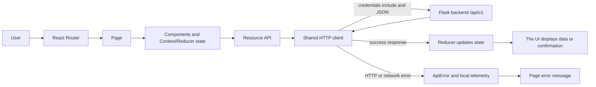
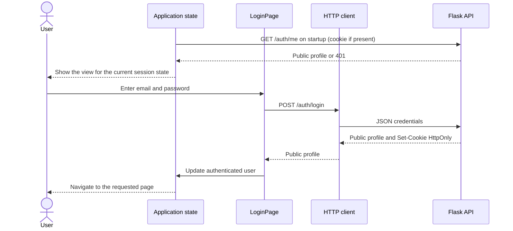

# Mis Eventos Frontend

Web application for discovering events, creating and managing events, managing sessions, and registering. It uses React 19, React Router, Context/Reducer, and Vite, and communicates with the Flask API through `src/api/`.

## Architecture and request flow

- `src/pages/`: event catalog and details, authentication, profile, owned events, and registrations.
- `src/components/`: forms, navigation, lists, loading and error states, and shared controls.
- `src/api/`: resource-specific API functions and the shared HTTP client.
- `src/state/`: context, reducers, and shared authentication and event state.
- `src/utils/`: validation, formatting, and presentation rules.
- `src/App.jsx` registers routes; `src/App.css` contains application styles.



On startup, the application requests `GET /api/v1/auth/me`. Login sends credentials to the backend, which sets the HttpOnly `access_token` cookie. The frontend does not store passwords or tokens in browser storage and sends `credentials: 'include'` with each request. Protected routes wait for session confirmation and redirect to `/login` when the user is unauthenticated. Event management is enabled after the owner endpoint confirms permission; the backend enforces authorization again.



Non-success responses become `ApiError` instances; pages show readable messages and loading or error states. Frontend telemetry is written to the browser console and is not sent to a collector.

## Requirements, configuration, and development

Node.js 22 or later and npm are required. From `frontend/`, install the locked dependencies with:

```sh
npm ci
npm run dev
```

Vite serves the application at <http://localhost:5173>. Local settings are shown in `.env.example`; copy it to `.env` only if you need overrides. Vite reads these variables on startup. `VITE_*` variables are included in browser code, so do not put secrets there.

| Variable | Purpose |
| --- | --- |
| `VITE_API_BASE_URL` | API prefix used by the browser client; defaults to `/api/v1`. Public. |
| `API_PROXY_TARGET` | Target for the Vite `/api` proxy; defaults to `http://localhost:5000`. Compose sets it to `http://backend:5000`. |
| `VITE_APP_ENVIRONMENT`, `VITE_APP_VERSION` | Environment and version labels for local telemetry events; default to `local` and `dev`. Public. |

In development, the browser requests `/api/v1` from Vite's origin, and Vite proxies `/api` to the backend. This avoids requiring Flask CORS configuration locally. If you configure a cross-origin API URL, ensure the target server allows credentials and the frontend origin; the current backend does not register its own CORS policy.

With Docker Compose, the frontend listens on port `5173` and its proxy targets the `backend` service; the browser URL remains <http://localhost:5173>. To configure and start the full application and apply migrations, follow the [backend guide](../backend/README.md#run-the-full-application) or run `make setup` and `make run` from the repository root.

## Routes and manual flows

| Route | Access | Purpose |
| --- | --- | --- |
| `/` and `/events` | Public | Event catalog, search, and pagination. |
| `/events/:eventId` | Public | Event details, sessions, and capacity; authenticated users can register. The creator manages the event and its sessions. `?edit=1` opens editing when authorized. |
| `/events/new` | Requires a session | Create an event. |
| `/login`, `/register` | Public | Sign in and create an account. |
| `/profile` | Requires a session | User profile and sign-out. |
| `/my-events` | Requires a session | Manage owned events. |
| `/my-registrations` | Requires a session | View, filter, and cancel the user's registrations. |

To test a browser flow:

1. Start the backend and database using the [backend guide](../backend/README.md#requirements-and-local-setup). Open Swagger at <http://localhost:5000/apidocs/> to inspect the API.
2. Open <http://localhost:5173>, create an account, or sign in.
3. Create a future event at `/events/new`. At `/my-events`, you can change its status, edit it, or delete an event you own.
4. Add or edit sessions on the event details page. Management controls appear only for the creator.
5. With another account, open the published event and register or cancel. Availability depends on capacity and dates.
6. Use `/my-registrations` to review your registrations. To test an endpoint separately, sign in through Swagger or use the requests and cookie jar in the [backend README](../backend/README.md#curl-examples).

Swagger is part of the backend, not a separate frontend application. Its UI is at <http://localhost:5000/apidocs/> and the JSON specification is at <http://localhost:5000/apispec_1.json> while the local backend is running. If ports or the API base URL change, check `.env` and `vite.config.js`.

## Tests and build

```sh
npm run test
npm run lint
npm run build
npm run preview
```

Tests run with `npm run test` use Node.js's built-in test runner and do not require the backend. The production build is written to `dist/`; `npm run preview` serves it locally for review.

### Playwright end-to-end tests

Install Chromium once per machine, then run E2E tests from this directory:

```sh
npx playwright install chromium
npm run test:e2e
```

You can also run `make test-e2e` from the repository root. Playwright starts Vite on port `4173`; tests intercept API requests and do not require a database or running backend. The suite covers event details and registration, error handling, permissions, event editing, session management, and a mobile viewport. Results and failure traces are written to `test-results/`, which Git ignores.

If requests fail, check that the backend responds at `http://localhost:5000/api/v1/ready`, confirm `API_PROXY_TARGET` points to the right backend, and inspect the browser's Network tab. Sessions use cookies: verify `GET /auth/me` returns 200 after login and that Secure is not enabled for local HTTP.
