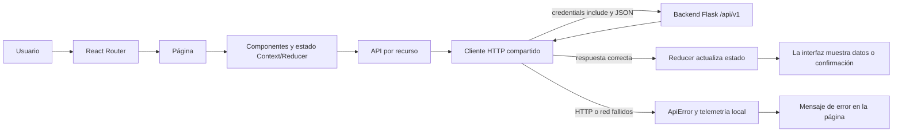
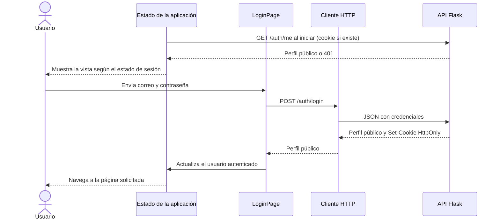

# Frontend de Mis Eventos

Aplicación web para descubrir eventos, crear y administrar eventos propios, gestionar sesiones e inscripciones. Utiliza React 19, React Router, Context/Reducer y Vite. Se comunica con la API Flask del backend mediante `src/api/`.

## Arquitectura y flujo

- `src/pages/`: catálogo, detalle, acceso, perfil, eventos propios e inscripciones.
- `src/components/`: formularios, navegación, listas, estados de carga/error y controles compartidos.
- `src/api/`: funciones por recurso y cliente HTTP compartido.
- `src/state/`: contexto, reducer y estado compartido de autenticación y eventos.
- `src/utils/`: validación, formatos y reglas de presentación.
- `src/App.jsx` registra las rutas; `src/App.css` contiene estilos de la aplicación.



La aplicación consulta `GET /api/v1/auth/me` al arrancar. El login envía credenciales al backend; el backend establece la cookie HttpOnly `access_token`. El frontend no guarda contraseñas ni tokens en almacenamiento del navegador y usa `credentials: 'include'` en cada petición. Las rutas privadas esperan a confirmar la sesión y redirigen a `/login` cuando no hay usuario autenticado. La administración de un evento se habilita cuando el endpoint de propietario confirma el permiso; el backend vuelve a aplicar la autorización.



Las respuestas no exitosas se convierten en `ApiError`; las páginas muestran mensajes comprensibles y estados de carga o error. La telemetría del frontend se escribe localmente en la consola del navegador y no transmite información a un colector.

## Requisitos, configuración y ejecución

Se requiere Node.js 22 o superior y npm. Desde `frontend/`, instala de forma reproducible con el lockfile:

```sh
npm ci
npm run dev
```

Vite sirve la aplicación en <http://localhost:5173>. La configuración local está en `.env.example`; copia el archivo a `.env` solo si necesitas personalizarla. Vite lee esas variables al iniciar y las variables `VITE_*` se incorporan al código visible en el navegador, así que no pongas secretos allí.

| Variable | Uso |
| --- | --- |
| `VITE_API_BASE_URL` | Prefijo de API que usa el cliente browser; predeterminado `/api/v1`. Es público. |
| `API_PROXY_TARGET` | Destino del proxy Vite `/api`; predeterminado `http://localhost:5000`. En Compose se configura como `http://backend:5000`. |
| `VITE_APP_ENVIRONMENT`, `VITE_APP_VERSION` | Etiquetas de entorno/versión para eventos de telemetría local; valores predeterminados `local` y `dev`. Son públicos. |

En desarrollo, el navegador solicita `/api/v1` en el mismo origen de Vite y este reenvía `/api` al backend. Así, el flujo local usa el proxy y no requiere una configuración CORS en Flask. Si configuras una URL de API entre distintos orígenes, verifica que el servidor destino permita credenciales y el origen correspondiente; el backend actual no registra una política CORS propia.

En Docker Compose, el frontend mantiene el puerto `5173` y el proxy apunta al servicio `backend`; la URL del navegador sigue siendo <http://localhost:5173>. Para iniciar toda la aplicación, preparar las variables y aplicar migraciones, sigue la [guía del backend](../backend/README.md#probar-la-aplicación-completa) o ejecuta desde la raíz `make setup` y `make run`.

## Rutas y flujos manuales

| Ruta | Acceso | Función |
| --- | --- | --- |
| `/` y `/events` | Público | Catálogo, búsqueda y paginación de eventos. |
| `/events/:eventId` | Público | Detalle, sesiones y cupos; usuarios autenticados pueden inscribirse. El creador administra el evento y sus sesiones. `?edit=1` abre la edición si tiene permiso. |
| `/events/new` | Requiere sesión | Crear un evento. |
| `/login`, `/register` | Público | Inicio de sesión y creación de cuenta. |
| `/profile` | Requiere sesión | Perfil del usuario y cierre de sesión. |
| `/my-events` | Requiere sesión | Administrar eventos propios. |
| `/my-registrations` | Requiere sesión | Consultar, filtrar y cancelar inscripciones propias. |

Para probar un recorrido en el navegador:

1. Inicia backend y base de datos siguiendo la [guía backend](../backend/README.md#requisitos-y-configuración-local); abre Swagger en <http://localhost:5000/apidocs/> para revisar la API consumida.
2. Abre <http://localhost:5173>, crea una cuenta o inicia sesión.
3. Crea un evento con fecha futura desde `/events/new`. En `/my-events` puedes cambiar el estado, editar o eliminar un evento propio.
4. En el detalle del evento agrega o modifica sesiones. La administración solo aparece para el creador.
5. Con otra cuenta, abre el evento publicado y prueba inscribirte y cancelar la inscripción; la capacidad y las fechas determinan si se permite.
6. Usa `/my-registrations` para revisar las inscripciones propias. Para verificar un endpoint por separado, haz login en Swagger o utiliza las peticiones y el cookie jar descritos en el [README del backend](../backend/README.md#ejemplos-con-curl).

Swagger pertenece al backend, no es una segunda aplicación frontend: su UI está en <http://localhost:5000/apidocs/> y la especificación JSON en <http://localhost:5000/apispec_1.json> cuando el backend local está levantado. Si cambias puertos o la URL base de API, consulta la configuración correspondiente en `.env` y `vite.config.js`.

## Pruebas y build

```sh
npm run test
npm run lint
npm run build
npm run preview
```

Las pruebas de `npm run test` usan el runner nativo de Node.js y no requieren el backend. El build de producción se escribe en `dist/`; `npm run preview` sirve ese build localmente para revisarlo.

### Pruebas end-to-end con Playwright

Instala Chromium una vez por equipo y ejecuta E2E desde este directorio:

```sh
npx playwright install chromium
npm run test:e2e
```

Desde la raíz también está disponible `make test-e2e`. Playwright inicia Vite en el puerto `4173` y los escenarios interceptan la API para que no dependan de una base de datos ni de un backend activo. La suite recorre detalle/registro, manejo de errores, permisos, edición del evento, administración de sesiones y un viewport móvil. Resultados y trazas de fallos quedan en `test-results/`, ignorado por Git.

Si las peticiones fallan, revisa que el backend responda en `http://localhost:5000/api/v1/ready`, que `API_PROXY_TARGET` apunte al backend adecuado y la pestaña Network de las herramientas de desarrollo. La sesión depende de cookies: comprueba que `GET /auth/me` responde 200 después del login y que no se haya configurado Secure en un entorno HTTP local.
